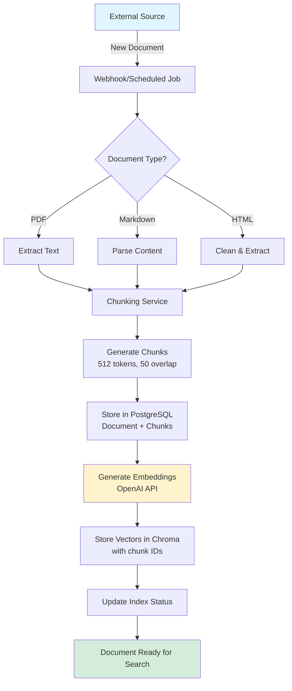
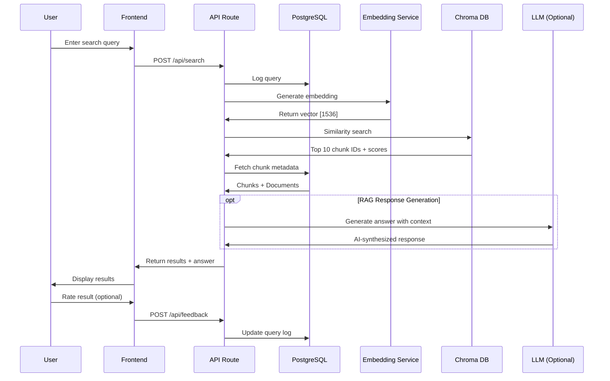
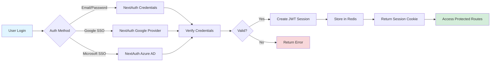
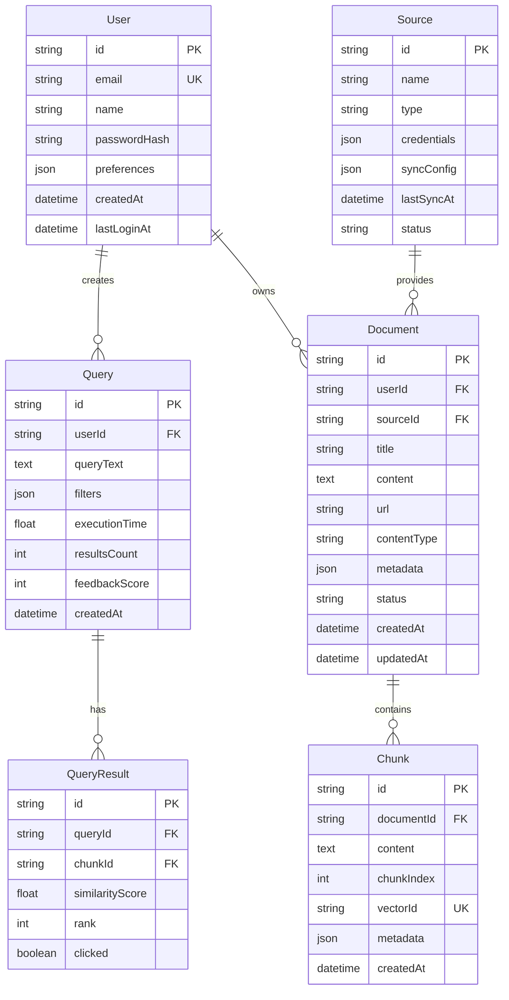
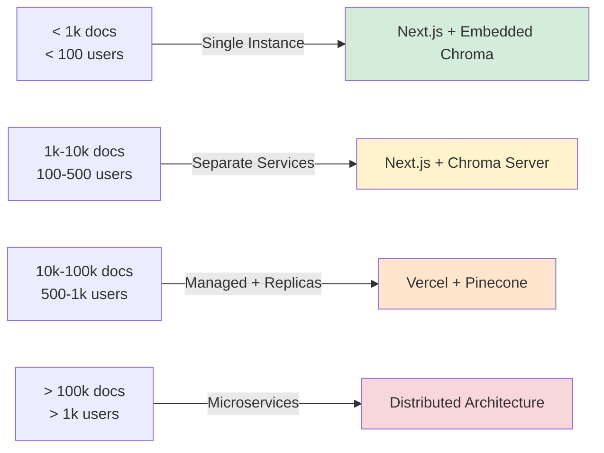

# RAG System Architecture
## Next.js + Prisma + PostgreSQL + Chroma

---

## 1. System Overview

```
┌─────────────────────────────────────────────────────────────────────┐
│                          CLIENT LAYER                               │
│  ┌──────────────┐  ┌──────────────┐  ┌──────────────┐             │
│  │   Web App    │  │  Mobile App  │  │   API SDK    │             │
│  │  (Browser)   │  │ (React Native)│ │  (3rd Party) │             │
│  └──────┬───────┘  └──────┬───────┘  └──────┬───────┘             │
└─────────┼──────────────────┼──────────────────┼────────────────────┘
          │                  │                  │
          └──────────────────┼──────────────────┘
                             │
┌────────────────────────────▼─────────────────────────────────────────┐
│                     NEXT.JS APPLICATION LAYER                        │
│  ┌────────────────────────────────────────────────────────────┐     │
│  │                      Frontend (React)                      │     │
│  │  • Search Interface  • Results Display  • User Dashboard   │     │
│  └────────────────────────────────────────────────────────────┘     │
│                                                                      │
│  ┌────────────────────────────────────────────────────────────┐     │
│  │                    API Routes (Backend)                    │     │
│  │  /api/search    /api/upload    /api/embed    /api/sync    │     │
│  └─────────┬──────────────┬──────────────┬──────────────┬─────┘     │
└────────────┼──────────────┼──────────────┼──────────────┼───────────┘
             │              │              │              │
        ┌────▼────┐    ┌────▼────┐    ┌────▼────┐    ┌────▼────┐
        │ Auth    │    │ Search  │    │ Ingest  │    │ Queue   │
        │ Service │    │ Service │    │ Service │    │ Manager │
        └────┬────┘    └────┬────┘    └────┬────┘    └────┬────┘
             │              │              │              │
┌────────────┼──────────────┼──────────────┼──────────────┼───────────┐
│                        DATA LAYER                                   │
│  ┌─────────▼──────────┐  ┌────────▼────────┐  ┌────────▼────────┐  │
│  │   PostgreSQL       │  │  Chroma Vector  │  │   Redis Cache   │  │
│  │   (Prisma ORM)     │  │      DB         │  │   & Queue       │  │
│  │                    │  │                 │  │                 │  │
│  │ • Users            │  │ • Embeddings    │  │ • Session       │  │
│  │ • Documents        │  │ • Vectors       │  │ • Job Queue     │  │
│  │ • Chunks           │  │ • Similarity    │  │ • Rate Limit    │  │
│  │ • Query Logs       │  │   Search        │  │                 │  │
│  └────────────────────┘  └─────────────────┘  └─────────────────┘  │
└─────────────────────────────────────────────────────────────────────┘
             │                      │                      │
┌────────────▼──────────────────────▼──────────────────────▼───────────┐
│                    EXTERNAL SERVICES LAYER                           │
│  ┌─────────────┐  ┌─────────────┐  ┌─────────────┐  ┌────────────┐ │
│  │   OpenAI    │  │   Google    │  │ Confluence  │  │   GitHub   │ │
│  │ Embeddings  │  │    Drive    │  │     API     │  │     API    │ │
│  └─────────────┘  └─────────────┘  └─────────────┘  └────────────┘ │
└──────────────────────────────────────────────────────────────────────┘
```

---

## 2. Core Components Architecture

### Component Breakdown

| Component | Technology | Purpose | Scalability |
|-----------|-----------|---------|-------------|
| **Frontend** | Next.js + React + TypeScript | User interface, search experience | Horizontal (CDN) |
| **API Layer** | Next.js API Routes | Business logic, orchestration | Horizontal (serverless) |
| **Metadata DB** | PostgreSQL + Prisma | Structured data, relationships | Vertical + read replicas |
| **Vector DB** | Chroma | Embedding storage, similarity search | Horizontal (sharding) |
| **Cache** | Redis | Session, rate limiting, job queue | Horizontal (cluster) |
| **Embeddings** | OpenAI API | Text to vector conversion | Managed service |

---

## 3. Data Flow Diagrams

### 3.1 Document Ingestion Flow



### 3.2 Search Query Flow



### 3.3 User Authentication Flow



---

## 4. Database Schema Design

### 4.1 PostgreSQL Schema (Prisma)



### 4.2 Chroma Collection Schema

```
Collection: "rag_documents"
├── Vectors (embeddings)
│   └── Dimension: 1536 (OpenAI text-embedding-3-small)
├── Metadata
│   ├── chunk_id: string (reference to PostgreSQL)
│   ├── document_id: string
│   ├── source: string
│   └── created_at: timestamp
└── Distance Metric: Cosine Similarity
```

---

## 5. API Routes Architecture

### 5.1 API Endpoints

| Endpoint | Method | Purpose | Auth Required |
|----------|--------|---------|---------------|
| `/api/auth/login` | POST | User authentication | No |
| `/api/auth/logout` | POST | End user session | Yes |
| `/api/search` | POST | Semantic search | Yes |
| `/api/documents` | GET | List user documents | Yes |
| `/api/documents` | POST | Upload new document | Yes |
| `/api/documents/:id` | DELETE | Remove document | Yes |
| `/api/embed` | POST | Generate embeddings | Yes |
| `/api/sources` | GET | List data sources | Yes |
| `/api/sources/sync` | POST | Trigger sync job | Yes (Admin) |
| `/api/feedback` | POST | Submit query feedback | Yes |
| `/api/analytics` | GET | Usage statistics | Yes (Admin) |

### 5.2 Search API Request/Response

```typescript
// POST /api/search
{
  "query": "What authentication method did we use?",
  "filters": {
    "source": ["confluence", "github"],
    "dateRange": {
      "start": "2024-01-01",
      "end": "2024-12-31"
    }
  },
  "limit": 10,
  "includeAnswer": true
}

// Response
{
  "query": "What authentication method did we use?",
  "executionTime": 1.24,
  "results": [
    {
      "chunkId": "chunk_abc123",
      "documentId": "doc_xyz789",
      "title": "Authentication Architecture",
      "content": "We implemented OAuth 2.0 with JWT...",
      "score": 0.89,
      "source": "confluence",
      "url": "https://...",
      "metadata": {
        "author": "John Doe",
        "lastModified": "2024-03-15"
      }
    }
  ],
  "synthesizedAnswer": {
    "content": "The team implemented OAuth 2.0...",
    "confidence": 0.85,
    "sources": ["doc_xyz789", "doc_abc456"]
  }
}
```

---

## 6. Data Ingestion Pipeline

```
┌──────────────────────────────────────────────────────────────┐
│                    INGESTION ORCHESTRATOR                    │
│                     (BullMQ + Redis)                         │
└────┬──────────────┬──────────────┬──────────────┬────────────┘
     │              │              │              │
┌────▼────┐   ┌────▼────┐   ┌────▼────┐   ┌────▼────┐
│ Google  │   │Confluence│  │ GitHub  │   │  Local  │
│ Drive   │   │  Sync   │   │  Sync   │   │  Upload │
│  Sync   │   │         │   │         │   │         │
└────┬────┘   └────┬────┘   └────┬────┘   └────┬────┘
     │             │              │             │
     └─────────────┼──────────────┼─────────────┘
                   │              │
              ┌────▼──────────────▼────┐
              │  Document Processor    │
              │  • Detect type         │
              │  • Extract text        │
              │  • Clean & normalize   │
              └────┬────────────────────┘
                   │
              ┌────▼────────────────┐
              │   Chunking Engine   │
              │   • Split by size   │
              │   • Add overlap     │
              │   • Preserve context│
              └────┬────────────────┘
                   │
         ┌─────────┴─────────┐
         │                   │
    ┌────▼────┐         ┌────▼────────┐
    │PostgreSQL│        │  Embedding   │
    │  Store  │        │  Generation  │
    │ Metadata│        │  (OpenAI)    │
    └─────────┘        └────┬─────────┘
                            │
                       ┌────▼────────┐
                       │   Chroma    │
                       │   Store     │
                       │  Vectors    │
                       └─────────────┘
```

### Ingestion Job Configuration

```typescript
// Job types and their schedules
const SYNC_JOBS = {
  googleDrive: {
    schedule: '*/15 * * * *',  // Every 15 minutes
    priority: 1,
    timeout: 600000  // 10 minutes
  },
  confluence: {
    schedule: '*/30 * * * *',  // Every 30 minutes
    priority: 2,
    timeout: 900000  // 15 minutes
  },
  github: {
    schedule: '0 */2 * * *',   // Every 2 hours
    priority: 3,
    timeout: 1200000  // 20 minutes
  }
}
```

---

## 7. Deployment Architecture

### 7.1 Development Environment

```
┌─────────────────────────────────────────────┐
│          Docker Compose Stack               │
│  ┌────────────┐  ┌────────────┐            │
│  │  Next.js   │  │ PostgreSQL │            │
│  │  Dev:3000  │  │   :5432    │            │
│  └────────────┘  └────────────┘            │
│  ┌────────────┐  ┌────────────┐            │
│  │   Chroma   │  │   Redis    │            │
│  │   :8000    │  │   :6379    │            │
│  └────────────┘  └────────────┘            │
└─────────────────────────────────────────────┘
```

### 7.2 Production Environment (Vercel + Managed Services)

```
┌──────────────────────────────────────────────────┐
│              Vercel Edge Network                 │
│  ┌──────────────────────────────────────┐       │
│  │     Next.js App (Serverless)         │       │
│  │  • Frontend: Edge Functions          │       │
│  │  • API Routes: Serverless Functions  │       │
│  └──────────┬──────────────┬────────────┘       │
└─────────────┼──────────────┼────────────────────┘
              │              │
     ┌────────▼───┐     ┌────▼─────────┐
     │  Vercel KV │     │Upstash Redis │
     │  (Redis)   │     │  (Optional)  │
     └────────────┘     └──────────────┘
              │
    ┌─────────┴──────────┬──────────────┬────────────┐
    │                    │              │            │
┌───▼────────┐  ┌────────▼─────┐  ┌────▼──────┐  ┌─▼────────┐
│ Supabase   │  │    Chroma     │  │  OpenAI   │  │  Google  │
│ PostgreSQL │  │  Cloud/Docker │  │    API    │  │Drive API │
│  (Managed) │  │  (Self-hosted)│  │           │  │          │
└────────────┘  └───────────────┘  └───────────┘  └──────────┘
```

### 7.3 Alternative: AWS Deployment

```
┌────────────────────────────────────────────────────┐
│               AWS Cloud Architecture               │
│  ┌──────────┐         ┌──────────┐                │
│  │CloudFront│◄───────►│    S3    │                │
│  │   CDN    │         │  Static  │                │
│  └────┬─────┘         └──────────┘                │
│       │                                            │
│  ┌────▼──────────────────────────┐                │
│  │  Application Load Balancer    │                │
│  └────┬──────────────┬────────────┘                │
│       │              │                             │
│  ┌────▼────┐    ┌────▼────┐                       │
│  │  ECS    │    │  ECS    │                       │
│  │Next.js 1│    │Next.js 2│                       │
│  └────┬────┘    └────┬────┘                       │
│       │              │                             │
│  ┌────▼──────────────▼────────┐                   │
│  │     ElastiCache Redis      │                   │
│  └────────────────────────────┘                   │
│       │              │                             │
│  ┌────▼────┐    ┌────▼────────┐                   │
│  │   RDS   │    │    ECS      │                   │
│  │Postgres │    │Chroma Server│                   │
│  └─────────┘    └─────────────┘                   │
└────────────────────────────────────────────────────┘
```

---

## 8. Performance Optimization Strategies

### Caching Layers

| Layer | Technology | TTL | Purpose |
|-------|-----------|-----|---------|
| **CDN** | Vercel Edge | 1 hour | Static assets, HTML |
| **Application** | Redis | 15 min | Search results, embeddings |
| **Database** | Prisma | Session | Query results |
| **Vector** | Chroma | N/A | Built-in indexing |

### Scaling Thresholds



---

## 9. Security Architecture

### Authentication & Authorization Flow

```
User Request
     │
     ▼
┌─────────────────┐
│  Next.js Auth   │
│  Middleware     │
└────────┬────────┘
         │
    ┌────▼────┐
    │ JWT     │
    │ Valid?  │
    └────┬────┘
         │
    ┌────▼──────────────┐
    │ Check Permissions │
    │ (PostgreSQL)      │
    └────┬──────────────┘
         │
    ┌────▼────────────┐
    │ Filter Results  │
    │ by User Access  │
    └─────────────────┘
```

### Data Security Layers

| Layer | Protection | Implementation |
|-------|-----------|----------------|
| **Transit** | TLS 1.3 | HTTPS everywhere |
| **Storage** | AES-256 | PostgreSQL encryption at rest |
| **Application** | JWT | Signed tokens, short expiry |
| **Vector DB** | Network isolation | VPC, private endpoints |
| **API** | Rate limiting | Redis-based throttling |

---

## 10. Monitoring & Observability

### Key Metrics to Track

```typescript
// Performance metrics
{
  "search": {
    "p50": "< 500ms",
    "p95": "< 2000ms",
    "p99": "< 5000ms"
  },
  "embedding": {
    "p50": "< 200ms",
    "p95": "< 800ms"
  },
  "ingestion": {
    "throughput": "100 docs/minute",
    "success_rate": "> 99%"
  }
}
```

### Monitoring Stack

```
Application Metrics ──┐
API Logs ────────────┼──► Vercel Analytics
Error Tracking ──────┘     or

Database Metrics ────┐
Query Performance ───┼──► Prisma Pulse
Connection Pool ─────┘

Vector DB Stats ─────┐
Search Latency ──────┼──► Custom Dashboard
Index Size ──────────┘     (Grafana + Prometheus)
```

---

## Summary

This architecture provides:

- **Scalability**: Start small, scale horizontally
- **Flexibility**: Swap components (Chroma → Pinecone, OpenAI → self-hosted)
- **Maintainability**: Clear separation of concerns
- **Performance**: Multi-layer caching, optimized queries
- **Security**: Authentication, encryption, access control
- **Observability**: Comprehensive monitoring and logging

**Technology Stack:**
- Frontend & API: Next.js 14+ (App Router)
- Database: PostgreSQL + Prisma ORM
- Vector DB: ChromaDB (MVP) → Pinecone (Production)
- Cache & Queue: Redis
- Embeddings: OpenAI API
- Deployment: Vercel (serverless) or AWS ECS (containers)
